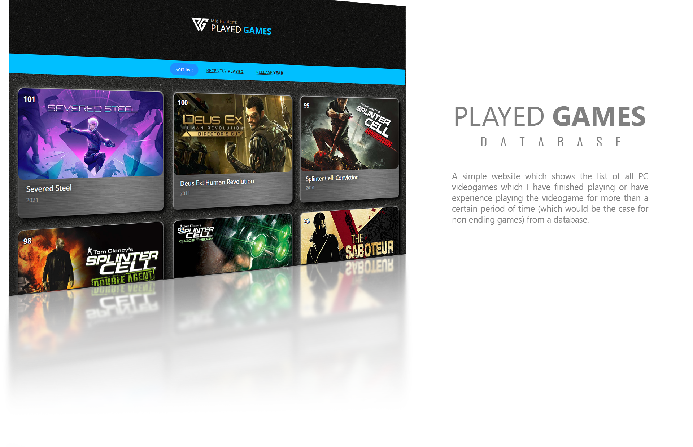

This is a webpage for keeping a list of all the PC games that I have finished playing.  

<!-- Previous Link: https://htmlpreview.github.io/?https://github.com/MidHunterX/played-games/blob/main/index.html -->

The main purpose of this beginner project is to familiarize :

- [x] **Grouping and structuring source directory**
  `Proper dir structure... this is the way`
- [x] **Structuring an HTML more effectively by utilizing JavaScript**
  `JS can be used to render recurring HTML using a loop soo...`
  `Less code = less work? ¯\_(ツ)_/¯`
  `Probably not.`
- [x] **Connecting a database to webpage**
  `JSON can be read using D3, JQuery, Fetch etc.`
  `Chose JSON because... no API calls, no login nothing.`
  `Perfect fit for my laziness.`
- [x] **Style elements using CSS**
  `Yep, no external libraries.`
  `No bootstrap. Going the long ugly route.`
- [x] **Responsive Web Design**
  `Using flex and media queries.`
- [ ] **Implementing search queries**
  `Using J-Query JavaScript library.`
